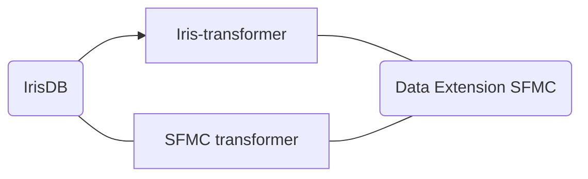
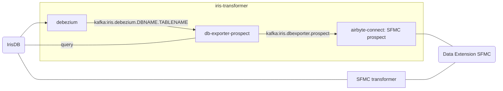

# hays-prospect-fast-reply

## Project goal

bla

## Components

bla

### Architecture and Workflow

#### Blackbox Overview

```mermaid
flowchart LR
is(IrisDB)
isT[Iris-transformer]
sfmc(Data Extension SFMC)
sfmcT[SFMC transformer]

    is --> isT
    isT --- sfmc
    sfmcT --- sfmc
    is --- sfmcT  
    
```

#### Components Overview

```mermaid
flowchart LR
is(IrisDB)
deb[debezium]
dbex[db-exporter-prospect]
abcon[airbyte-connect: SFMC prospect]
sfmc(Data Extension SFMC)
sfmcT[SFMC transformer]

    is --> deb
    
    subgraph iris-transformer
        deb -->|kafka:iris.debezium.DBNAME.TABLENAME| dbex
        dbex -->|kafka:iris.dbexporter.prospect| abcon
    end

    abcon --- sfmc
    is ---|query| dbex
    
    sfmcT --- sfmc
    is --- sfmcT  
    
```