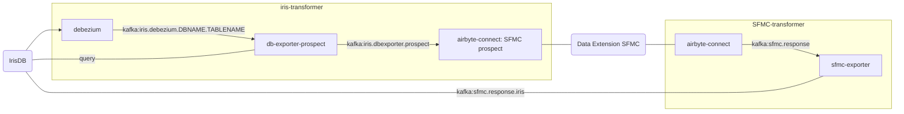

# hays-prospect-fast-reply

## Scenario
- Sales representatives send job offers to Candidates/Prospects. 
- Candidates/Prospects can then answer on job offer.

## Project Goal
- Synchronize dedicated data from IRIS to Salesforce Marketing Cloud
- Synchronize dedicated data from Salesforce Marketing Cloud back to IRIS.

## Specifications, Requirements and User Stories

- [Specifications (Confluence)](https://atari:8443/wiki/display/SAL/Spezifikation+Prospect+Fast+Reply)

## Components

- Get change events about IRIS fields from ??? database
- ...

### Architecture and Workflow

#### Blackbox Overview

#### Components Overview

